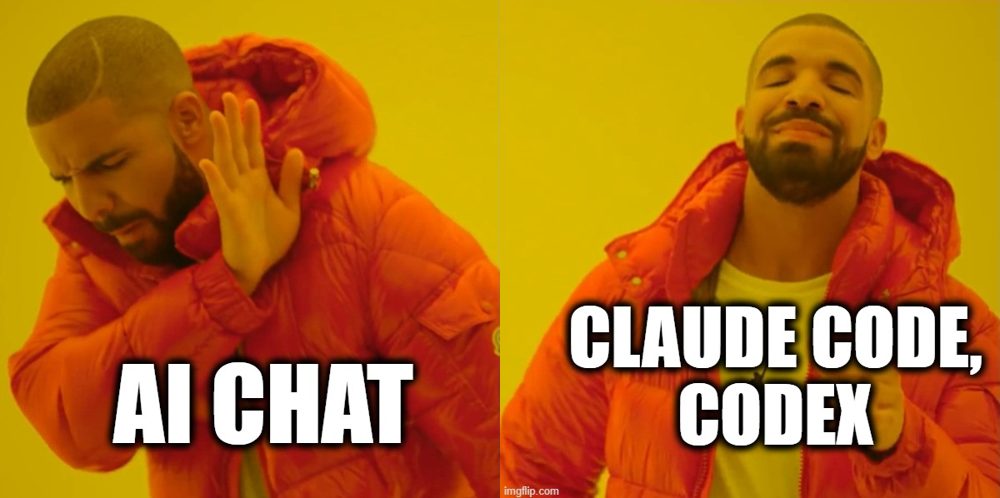

# Claude Code Settings



Meine persönliche Konfiguration für [Claude Code](https://claude.com/claude-code): globale Einstellungen,
Coding Conventions und drei Skills (Softwaredokumentation, Browserautomatisierung, AsciiDoc-Dokumente).
Alle Dateien gehören in das Benutzerverzeichnis `%USERPROFILE%\.claude` (also z. B.
`C:\Users\Michael\.claude`) und gelten dann für *alle* Projekte.

## Installation

**Eingabeaufforderung** öffnen (Start-Menü, `cmd` eintippen; Adminrechte sind nicht nötig) und die beiden
folgenden Zeilen nacheinander ausführen. Die erste lädt das Skript [install.ps1](install.ps1) herunter, die
zweite führt es aus:

```bat
curl.exe -sL -o "%TEMP%\install_claude.ps1" https://raw.githubusercontent.com/schletz/claude_settings/main/install.ps1
powershell -NoProfile -ExecutionPolicy Bypass -File "%TEMP%\install_claude.ps1"
```

Das Skript lädt dieses Repository herunter und kopiert die unten beschriebenen Dateien nach
`%USERPROFILE%\.claude`. Bereits vorhandene Dateien werden dabei **ohne Sicherung überschrieben** – wer seine
`CLAUDE.md` oder `settings.json` schon angepasst hat, sichert sie vorher selbst.

## Inhalt

| Datei im Repo | Ziel am eigenen Rechner | Zweck |
| --- | --- | --- |
| [settings.json](settings.json) | `%USERPROFILE%\.claude\settings.json` | Modell, Effort Level und Freigaben (Permissions) |
| [CLAUDE.md](CLAUDE.md) | `%USERPROFILE%\.claude\CLAUDE.md` | Globale Anweisungen an Claude für alle Projekte |
| [skills/document-software/](skills/document-software/) | `%USERPROFILE%\.claude\skills\document-software\` | Skill zur Erstellung agentenlesbarer Doku |
| [skills/playwright-cli/](skills/playwright-cli/) | `%USERPROFILE%\.claude\skills\playwright-cli\` | Skill zur Browsersteuerung und für E2E-Tests |
| [skills/asciidoc/](skills/asciidoc/) | `%USERPROFILE%\.claude\skills\asciidoc\` | Skill zur Erstellung von AsciiDoc-Dokumenten und deren PDF-Konvertierung |

### settings.json

Die [settings.json](settings.json) ist die globale Konfigurationsdatei von Claude Code. Sie gilt für alle
Projekte; ein Projekt kann einzelne Werte in `.claude/settings.json` im Projektordner überschreiben.
Die Datei ist bewusst kurz gehalten – sie legt das Modell, die Denktiefe und die Freigaben fest:

| Eintrag | Wert | Bedeutung |
| --- | --- | --- |
| `model` | `opus[1m]` | Standardmodell für neue Sitzungen: Opus mit dem großen Kontextfenster (1 Mio. Token). Damit passt auch ein umfangreiches Projekt in eine Sitzung. Im Chat jederzeit mit `/model` umstellbar. |
| `effortLevel` | `high` | Wie lange Claude vor der Antwort nachdenkt. `high` liefert bei Programmieraufgaben deutlich bessere Ergebnisse, kostet aber mehr Zeit und Token. |
| `permissions.allow` | siehe Datei | Werkzeuge, die Claude ohne Rückfrage benutzen darf – Dateien lesen und schreiben, Shell-Befehle ausführen, Websuche und der Skill *playwright-cli*. |
| `permissions.defaultMode` | `bypassPermissions` | Es wird generell **nicht** mehr nachgefragt. Siehe die Warnung am Ende dieser Datei. |
| `skipDangerousModePermissionPrompt` | `true` | Unterdrückt zusätzlich die Sicherheitsabfrage beim Start, die auf genau diesen Modus hinweist. |
| `autoUpdatesChannel` | `latest` | Claude Code aktualisiert sich selbst auf die jeweils neueste Version. |
| `theme` | `auto` | Farbschema folgt der Einstellung des Betriebssystems (hell/dunkel). |
| `remoteControlAtStartup` | `true` | Die Sitzung ist von einem anderen Gerät aus (z. B. der Claude-App am Handy) einsehbar und steuerbar. |

Wer einzelne Punkte anders haben will, ändert sie direkt in `%USERPROFILE%\.claude\settings.json`.
Die bequemere Variante für Modell und Theme ist der Befehl `/config` im Chat.

### CLAUDE.md

Die [CLAUDE.md](CLAUDE.md) ist eine Art Hausordnung, die Claude bei *jeder* Sitzung automatisch mitliest –
egal, in welchem Projekt. Alles, was man sonst in jedem zweiten Prompt wiederholen müsste, steht hier
einmal. Ihr Inhalt gliedert sich in folgende Abschnitte:

- **Lokale Umgebung** – welche Frameworks, Laufzeiten und IDEs installiert sind (.NET, Java, Python,
  Node.js, Docker, Visual Studio, VS Code) und wo Home-Verzeichnis und Browser liegen. Damit rät Claude
  nicht, welche Sprachversion es benutzen darf, und schlägt keine Werkzeuge vor, die es gar nicht gibt.
- **Globale Skills** – ein Hinweis auf *playwright-cli* und *document-software*, damit Claude sie auch
  dann in Betracht zieht, wenn man sie nicht ausdrücklich nennt.
- **Webrecherche** – eine Eskalationsstrategie für den Fall, dass eine Seite den Abruf mit HTTP 403
  ablehnt: erst `curl` mit vollständigen Browser-Headern, dann der Skill *playwright-cli*. Außerdem die
  Regel, große HTML-Seiten erst zu Text zu reduzieren, statt sie komplett in den Kontext zu laden.
- **Sprache** – Erklärungen und Zusammenfassungen auf Deutsch und per "du", Code, Bezeichner und
  Kommentare dagegen ausschließlich auf Englisch.
- **Kommentare** – Doc-Kommentare im Standard der jeweiligen Sprache (JSDoc, Docstrings, XML-Doc,
  Javadoc), Inline-Kommentare nur für nicht-triviale Logik und keine Meta-Kommentare über die Änderung
  selbst (`// added by Claude`).
- **Patterns** – SOLID und DRY, besonders Single Responsibility, aber pragmatisch statt over-engineered.
  Wo möglich soll das Typsystem Fehler schon zur Übersetzungszeit verhindern.
- **Test und Metriken, Datei-Struktur** – eine öffentliche Klasse pro Datei; nach einem Refactoring die
  Zeilenzahl als Indiz für verletzte Zuständigkeitsgrenzen prüfen.
- **Arbeitsweise** – vor größeren Umbauten nachfragen und getroffene Annahmen offenlegen.
- **Qualität des Prompts rückmelden** – Claude soll sagen, wenn ein Prompt zu wenig Information
  enthält oder umgekehrt so detailliert ist, dass er dem Modell jeden Spielraum nimmt.

> **Bitte nach der Installation anpassen:** Der Abschnitt *Lokale Umgebung* beschreibt den Rechner des
> Autors. Wer andere Versionen, eine andere IDE oder einen anderen Browser installiert hat, trägt das in
> `%USERPROFILE%\.claude\CLAUDE.md` ein – sonst geht Claude von falscher Software aus. Darauf weist auch
> das Installationsskript am Ende hin.

Dieselbe Datei kann zusätzlich pro Projekt angelegt werden (`CLAUDE.md` im Projektstammverzeichnis, in
Git eingecheckt). Dort gehören Regeln hin, die nur für dieses eine Projekt gelten; die globale Datei
bleibt davon unberührt.

### Skill *document-software*

Ein [Skill](skills/document-software/SKILL.md) ist eine Arbeitsanweisung, die Claude erst dann lädt, wenn
sie zur Aufgabe passt – erkennbar an der Beschreibung im Kopf der Datei. Dieser Skill wird aktiv, sobald
man um eine Dokumentation zu bestehendem Code bittet ("dokumentiere dieses Modul", "erstelle ein
Kontext-Dokument für ein LLM").

Das Ergebnis ist bewusst **kein** Benutzerhandbuch, sondern eine Referenzdatei `<name>.md` neben dem Code,
die ein LLM oder ein neuer Entwickler *statt* des Quellcodes liest: Invarianten, Herkunft magischer Zahlen,
Fehlerpfade und Erweiterungspunkte statt abgeschriebener Signaturen. Jede Aussage wird mit `Datei:Zeile`
verankert.

Der Ordner enthält neben der [SKILL.md](skills/document-software/SKILL.md) noch `references/vorlage.md` –
eine Vorlage mit fertiger Gliederung, die Claude bei Bedarf nachlädt.

Aufruf im Chat wahlweise implizit ("dokumentiere `parser.py`") oder explizit über `/document-software`.

### Skill *playwright-cli*

Erlaubt Claude, einen Browser fernzusteuern: Seiten öffnen, klicken, Formulare ausfüllen, Screenshots
machen und Playwright-Tests schreiben bzw. ausführen – nützlich für End-to-End-Tests von Webanwendungen.
Statt Pixelkoordinaten arbeitet der Skill mit einem *Snapshot* der Seite, in dem jedes Element eine kurze
Referenz (`e15`) trägt; Claude klickt also auf benannte Elemente statt auf Bildpunkte.

Der Skill wird in der [CLAUDE.md](CLAUDE.md) als globaler Skill erwähnt und ist in der
[settings.json](settings.json) freigegeben. Die [SKILL.md](skills/playwright-cli/SKILL.md) verweist auf
neun Referenzdateien in [references/](skills/playwright-cli/references/), die Claude bei Bedarf nachlädt –
etwa zu Testgenerierung, Request-Mocking, Session-Handling, Tracing und Videoaufzeichnung.

Die Skill-Dateien kommen aus diesem Repository, das eigentliche Kommandozeilenwerkzeug muss aber einmalig
installiert werden:

```powershell
npm install -g @playwright/cli@latest
playwright-cli install --skills
```

Dokumentation: <https://www.npmjs.com/package/@playwright/cli>

### Skill *asciidoc*

Erstellt AsciiDoc-Dokumente (`.adoc`) mit PlantUML-Diagrammen, LaTeX-Formeln, Zitaten und
Literaturverzeichnis und konvertiert sie per Docker-Container in ein PDF. Der Skill wird aktiv, sobald man
ein AsciiDoc-Dokument schreiben, erweitern oder als PDF ausgeben will – auch bei englischen Formulierungen
wie "write an asciidoc document" oder "convert .adoc to pdf".

Die [SKILL.md](skills/asciidoc/SKILL.md) legt Schreibregeln für den AsciiDoc-Text fest (ein Satz pro
Zeile, Leerzeile vor Listen, Querverweise dürfen nicht mit einer Ziffer beginnen) und verweist auf
`references/vorlage.adoc` – eine vollständige Vorlage mit allen Modulen, von der aus ein neues Dokument
angelegt wird.

Die PDF-Konvertierung übernimmt [scripts/convert_to_pdf.py](skills/asciidoc/scripts/convert_to_pdf.py)
über das Docker-Image `asciidoctor/docker-asciidoctor`. Das Skript spricht direkt mit der Docker-Engine
(kein `docker run` über die Shell), läuft daher unverändert unter Windows, macOS und Linux, aktiviert
`asciidoctor-diagram` (PlantUML) und `asciidoctor-mathematical` (LaTeX-Formeln) und räumt erzeugte
Zwischendateien danach selbst wieder auf.

Voraussetzung: Docker muss laufen (lokal per Docker Desktop) und das Python-Paket `docker` installiert
sein (`pip install docker`).

Aufruf im Chat wahlweise implizit ("schreib mir ein AsciiDoc-Dokument über X") oder explizit über
`/asciidoc`.


## ⚠️ Warnung: `"defaultMode": "bypassPermissions"`

Die mitgelieferte [settings.json](settings.json) setzt

```json
"permissions": {
  "defaultMode": "bypassPermissions"
}
```

Das bedeutet: **Claude Code fragt vor keiner Aktion mehr nach.** Es liest, ändert und löscht Dateien,
führt Shell- und PowerShell-Befehle aus, installiert Pakete und ruft Webseiten ab – alles ohne
Bestätigungsdialog. Zusammen mit `"skipDangerousModePermissionPrompt": true` entfällt auch der
Warnhinweis beim Start.

Der Modus ist bequem und spart viele Klicks, aber die Verantwortung liegt damit vollständig bei dir:

- Ein falsch verstandener Auftrag kann Dateien überschreiben oder löschen, ohne dass du eingreifen
  kannst. Arbeite deshalb nur in Verzeichnissen unter Versionskontrolle und committe regelmäßig.
- Claude darf beliebige Befehle ausführen – auch solche, die aus dem Internet geladenen Inhalt
  auswerten. Inhalte fremder Webseiten oder Repositories können Anweisungen enthalten (Prompt Injection).
- Zugangsdaten, Tokens und private Dateien im Arbeitsverzeichnis sind für Claude lesbar.

**Jede und jeder muss selbst entscheiden, ob er so arbeiten will.** Wer das nicht möchte, entfernt die
Zeile `"defaultMode": "bypassPermissions"` (und am besten auch
`"skipDangerousModePermissionPrompt": true`) aus `%USERPROFILE%\.claude\settings.json`. Dann gilt wieder
der Standardmodus, in dem Claude vor jeder schreibenden oder ausführenden Aktion um Erlaubnis fragt. Die
Liste unter `permissions.allow` bleibt davon unberührt und kann Schritt für Schritt erweitert werden –
im Chat mit `/permissions` oder direkt in der Datei.

## CLAUDE.md nach der Installation prüfen lassen

Der Abschnitt *Lokale Umgebung* in der `CLAUDE.md` beschreibt den Rechner des Autors – Frameworks, IDEs,
Home-Verzeichnis, Browserpfad. Auf dem eigenen Rechner stimmt das selten zu hundert Prozent. Statt die
Datei von Hand zu vergleichen, lässt man Claude selbst nachsehen: neuen Chat öffnen und folgenden Prompt
einfügen.

```text
Prüfe den Abschnitt "Lokale Umgebung" in meiner globalen CLAUDE.md oder AGENTS.md
(%USERPROFILE%\.claude\CLAUDE.md bzw. %USERPROFILE%\.codex\AGENTS.md) gegen die tatsächlich auf diesem Rechner installierte Software.
Kontrolliere dabei:
- Windows-Version (winver bzw. Registry)
- installierte Framework-Versionen: .NET, Java, Python, Node.js (jeweils --version bzw. java -version)
- ob Docker installiert und der Docker-Daemon erreichbar ist
- ob git bash installiert ist
- die installierten IDEs (VS Code, Visual Studio mit den genannten Komponenten)
- den Pfad zum Browser (existiert die angegebene .exe?)
- ob das Home-Verzeichnis in der Datei mit %USERPROFILE% übereinstimmt

Liste Abweichungen auf und schlage konkrete Korrekturen für die Datei vor. Ändere die Datei erst,
wenn ich zugestimmt habe.
```

Claude vergleicht die Einträge mit dem, was auf dem Rechner tatsächlich läuft, und schlägt passende
Korrekturen vor, statt sie ungefragt zu übernehmen.

## Äquivalent für Codex-User

Wer statt Claude Code das [Codex CLI](https://developers.openai.com/codex/cli) von OpenAI einsetzt, findet
für jede der drei Dateiarten aus diesem Repo eine direkte Entsprechung – die Konzepte sind praktisch
identisch, nur Dateiname und Speicherort unterscheiden sich:

| Datei in diesem Repo | Codex-Entsprechung | Ziel am eigenen Rechner |
| --- | --- | --- |
| `settings.json` | `config.toml` | `%USERPROFILE%\.codex\config.toml` |
| `CLAUDE.md` | `AGENTS.md` | `%USERPROFILE%\.codex\AGENTS.md` |
| `skills/<name>/SKILL.md` | Skills (gleiches Format) | `%USERPROFILE%\.agents\skills\<name>\SKILL.md` |

`AGENTS.md` und die Skills installiert das [install.ps1](install.ps1) automatisch mit: Existiert beim
Ausführen bereits ein `%USERPROFILE%\.codex`-Ordner, fragt das Skript nach, ob diese beiden zusätzlich
installiert werden sollen. `config.toml` bleibt davon ausgenommen (siehe unten) und muss von Hand angelegt
werden.

- **`config.toml`** ist das Gegenstück zur `settings.json`, aber im TOML- statt JSON-Format und mit eigenen
  Schlüsseln (u. a. für Modell und Approval-/Sandbox-Policy). Die Werte aus diesem Repo lassen sich daher
  nicht kopieren, sondern müssen sinngemäß in die Codex-Syntax übertragen werden.
- **`AGENTS.md`** entspricht der `CLAUDE.md` eins zu eins: Die globale Datei unter `~/.codex/AGENTS.md` gilt
  für alle Projekte und wird mit einer projektbezogenen `AGENTS.md` zusammengeführt – Codex hängt die Dateien
  von der Git-Root abwärts aneinander, wobei die Datei näher am Arbeitsverzeichnis spätere (und damit
  vorrangige) Anweisungen liefert. Da beide Formate reiner Markdown-Text ohne Claude-spezifische Syntax
  sind, lässt sich der Inhalt der `CLAUDE.md` aus diesem Repo im Wortlaut übernehmen.
- **Skills** funktionieren in Codex nach demselben Prinzip: ein Verzeichnis mit `SKILL.md` (plus optional
  `scripts/` und `references/`), das anhand der `description` automatisch oder explizit per `$skill-name`
  geladen wird. Global liegen sie unter `~/.agents/skills/<name>/`, projektbezogen unter
  `.agents/skills/<name>/` im Repo-Root. Die drei Skill-Ordner aus [skills/](skills/) lassen sich daher
  unverändert dorthin kopieren.
